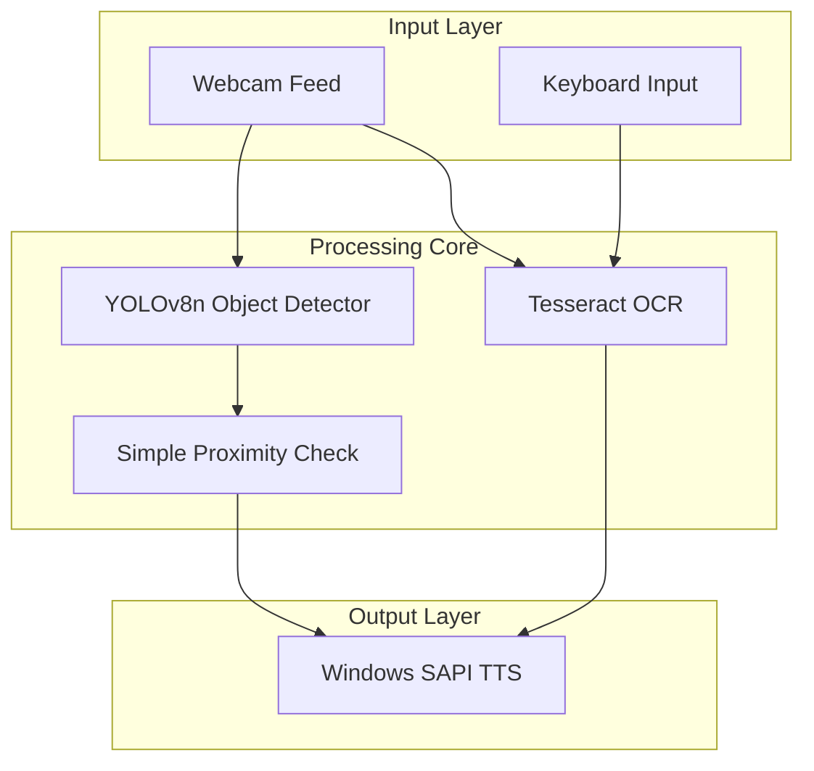

# Design Document

## Overview

VisionMate-Lite is designed as a minimal, achievable assistive vision system for solo development within the 5-week COMP5523 timeline (November-December 2025). The system operates entirely on-device using a standard laptop webcam and built-in audio, focusing on core functionality that can be reliably implemented and demonstrated.

The system consists of two main processing pipelines with one optional component:
1. **Continuous Object Detection Pipeline**: Real-time detection of 3-4 key object classes with simple audio alerts
2. **On-Demand OCR Pipeline**: User-triggered text extraction using keyboard input
3. **Optional Scene Classification**: Simple environment labeling (only if time permits)

**Scope Limitations for Solo Feasibility:**
- Maximum 4 object classes for detection (person, chair, door, car)
- Simple proximity heuristic using bounding box size only
- Basic audio alerts without complex spatial information
- Tesseract OCR only (no advanced OCR models)
- Cross-platform deployment (Windows/macOS) using built-in TTS engines

## Architecture



## Components and Interfaces

### 1. Camera Interface
**Purpose**: Manages webcam access and frame capture
**Technology**: OpenCV VideoCapture
**Key Methods**:
- `initialize_camera(camera_index=0)`: Initialize default webcam
- `get_frame()`: Capture current frame as numpy array
- `release()`: Clean up camera resources

**Design Decisions**:
- Use OpenCV for cross-platform camera access
- Default to camera index 0 for simplicity
- Implement graceful fallback if camera unavailable

### 2. Object Detection Module
**Purpose**: Real-time detection of 4 key navigation objects
**Technology**: Pre-trained YOLOv8n model (ultralytics package) - no custom training required
**Key Classes**:
```python
class ObjectDetector:
    def __init__(self, confidence_threshold=0.5)
    def detect(self, frame) -> List[Detection]
    def is_close_proximity(self, bbox, frame_shape) -> bool

class Detection:
    def __init__(self, class_name, confidence, bbox)
```

**Design Decisions**:
- Use ultralytics YOLOv8n package directly (no ONNX conversion needed)
- Hardcode 4 target classes: person, chair, car, door (COCO classes 0, 56, 2, custom mapping)
- Simple proximity: if bounding box area > 15% of frame area, consider "close"
- No complex distance estimation - just "ahead" vs "close ahead"
- Process every 3rd frame to maintain performance on CPU

### 3. OCR Engine
**Purpose**: Extract and process text from captured frames
**Technology**: Tesseract OCR with Python wrapper (pytesseract)
**Key Methods**:
- `extract_text(frame)`: Extract text from image
- `preprocess_image(frame)`: Enhance image for better OCR accuracy
- `validate_text(text)`: Filter out garbled or nonsensical results

**Design Decisions**:
- Use Tesseract for offline, no-dependency OCR
- Implement image preprocessing (grayscale, contrast enhancement)
- Add text validation to avoid reading noise as text

### 4. Audio Management System
**Purpose**: Simple audio output without complex queuing
**Technology**: Windows SAPI (pyttsx3) - single threaded for simplicity
**Key Classes**:
```python
class AudioManager:
    def __init__(self, speech_rate=200)
    def speak_alert(self, message)
    def speak_text(self, text)
    def is_busy() -> bool
```

**Design Decisions**:
- No complex priority queuing - keep it simple
- Block new audio while speaking (avoid overlapping speech)
- Use pyttsx3 with Windows SAPI engine (built into Windows)
- Simple alert messages: "Person ahead", "Chair detected", "Door nearby"
- For OCR: just read the extracted text directly

### 5. Proximity Estimation
**Purpose**: Simple proximity detection using bounding box size
**Technology**: Basic area calculation - no depth estimation
**Key Methods**:
- `is_close(bbox, frame_shape)`: Returns True if bbox area > 15% of frame
- `get_largest_detection(detections)`: Return detection with biggest bounding box

**Design Decisions**:
- Extremely simple: large bounding box = close object
- No distance estimation in meters - just "close" vs "not close"
- Alert only on "close" objects to reduce noise
- If multiple close objects, alert on the largest one only

### 6. Configuration Manager
**Purpose**: Simple configuration with minimal complexity
**Technology**: Basic Python config file or environment variables
**Configuration Structure**:
```python
# config.py - Simple Python configuration
CONFIDENCE_THRESHOLD = 0.5
PROXIMITY_THRESHOLD = 0.15  # 15% of frame area
ALERT_COOLDOWN_SECONDS = 5
SPEECH_RATE = 200
OCR_TRIGGER_KEY = 'space'  # Spacebar to trigger OCR
CAMERA_INDEX = 0

# Environment variables for evaluation
TEST_DATA_PATH = os.getenv('TEST_DATA_PATH', 'test_data/')
ENABLE_LOGGING = os.getenv('ENABLE_LOGGING', 'false').lower() == 'true'
```

**Design Decisions**:
- Use simple Python config file instead of JSON parsing
- Minimal configuration options to reduce complexity
- Environment variables only for test data paths and logging
- Hardcode reasonable defaults for solo development

## Data Models

### Detection Data Model (Simplified)
```python
class Detection:
    def __init__(self, class_name, confidence, bbox):
        self.class_name = class_name
        self.confidence = confidence
        self.bbox = bbox  # (x1, y1, x2, y2)
    
    def get_area(self):
        return (self.bbox[2] - self.bbox[0]) * (self.bbox[3] - self.bbox[1])
    
    def is_close(self, frame_width, frame_height):
        frame_area = frame_width * frame_height
        return self.get_area() / frame_area > 0.15
```

### Simple Alert Messages
```python
# No complex data models - just string messages
ALERT_MESSAGES = {
    'person': 'Person ahead',
    'chair': 'Chair detected', 
    'car': 'Car nearby',
    'door': 'Door detected'
}
```

## Error Handling

### Camera Errors
- **Camera not found**: Graceful degradation with audio notification
- **Camera access denied**: Clear error message with troubleshooting steps
- **Frame capture failure**: Retry mechanism with exponential backoff

### Model Loading Errors
- **Model file not found**: Download fallback or use alternative model
- **ONNX runtime errors**: Fallback to CPU provider, adjust batch size
- **Memory errors**: Reduce input resolution, implement model quantization

### Audio System Errors
- **TTS engine unavailable**: Fallback to system beeps for critical alerts
- **Audio device errors**: Queue messages and retry when device available
- **Speech interruption**: Implement graceful stop and resume functionality

### OCR Processing Errors
- **Text extraction failure**: Provide user feedback and suggestions
- **Image quality issues**: Implement automatic preprocessing adjustments
- **Language detection errors**: Default to English with user override option

## Testing Strategy

### Minimal Testing Approach (Solo Project)
- **Basic functionality testing**: Manual testing of detection and OCR on sample images
- **Performance measurement**: Simple timing of detection and OCR operations
- **Small dataset evaluation**: 50-100 test images collected personally

### Evaluation Framework (Simplified)
```python
class SimpleEvaluator:
    def __init__(self, test_images_folder):
        self.test_images = self.load_test_images(test_images_folder)
    
    def measure_detection_latency(self):
        # Time detection on test images, calculate average
        pass
    
    def measure_ocr_latency(self):
        # Time OCR on text images, calculate average
        pass
    
    def count_detection_accuracy(self):
        # Manual verification of detection results
        pass
```

### Realistic Performance Targets
- **Detection latency**: Target <500ms average on laptop CPU (relaxed from 300ms)
- **OCR processing**: Target <10 seconds end-to-end (relaxed from 5s)
- **Memory usage**: Target <1GB RAM for basic operation
- **Startup time**: Target <30 seconds to load models and initialize

### Manual Testing Scenarios
1. **Person detection**: Walk in front of camera, verify audio alert
2. **Object detection**: Place chair/object in view, verify detection
3. **OCR testing**: Hold up printed text, press spacebar, verify reading
4. **Performance testing**: Run for 10 minutes, measure average response times

## Privacy and Security Considerations

### Data Handling
- **Frame processing**: Process frames in memory only, no persistent storage by default
- **Debug mode**: Optional frame logging with clear user consent and easy deletion
- **Metrics collection**: Aggregate performance data only, no raw image data

### Configuration Security
- **Environment variables**: Use for sensitive paths and settings
- **Config validation**: Sanitize all user inputs and file paths
- **Credential management**: Never hardcode API keys or sensitive data

### Network Security
- **Offline operation**: No network communication required or implemented
- **Model distribution**: Bundle models with application or use secure download
- **Update mechanism**: Manual updates only, no automatic network calls