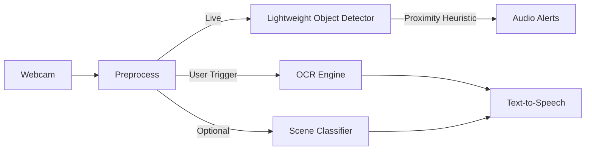

# VisionMate-Lite: Solo Project Concept (COMP5523)

This document outlines a minimal, solo-feasible assistive vision system aligned with the course spec in `c:\Users\EverGarden13\Downloads\Group Project\COMP5523 Group Project Specification-2025(1).md`.

- **Marks assumption**: Skipping Presentation forfeits 3%, leaving a maximum of 12% (Appropriateness, Soundness, Excitement, Writing). Confirm with instructor/TAs.
- **Hardware**: Standard laptop with webcam and microphone suffices. GPU is optional for better real-time speed. No special sensors required.
- **Dates**: Presentation (Nov 25, 2025) — not attending. Report due Dec 2, 2025 (max 8 pages, single column, TNR 12pt, 1.0 spacing, 1-inch margins).

---

## 1. Project Goal
Build a lightweight, on-device assistant that helps visually impaired users with:
- **Object/Obstacle Alerts**: Detect nearby objects and provide simple audio alerts.
- **On-demand OCR Reading**: Read visible text aloud when triggered by the user.
- (Optional) **Scene Label**: Provide a brief scene category (e.g., “office”, “street”).

Focus is on practicality, reliability, and low-latency feedback using a laptop webcam.

## 2. System Overview
- **Input**: Laptop webcam video stream.
- **Processing**: Lightweight detection + optional scene label + OCR on demand.
- **Output**: Audio feedback (short alerts; speech for OCR results).
- **Constraint**: Offline/on-device processing for privacy; no cloud calls.

## 3. Features and Behavior
- **Object/Obstacle Alerts**
  - Detect a small set of common classes relevant to navigation (e.g., person, chair, door, car).
  - Use a simple proximity cue (bounding box size threshold or optional monocular depth estimate) to decide when to alert.
  - Provide concise audio: e.g., “Person ahead, one meter” (if depth estimate) or “Person ahead” (if heuristic only).

- **On-demand OCR Reading**
  - User presses a key to capture a frame (or center-crop ROI) for OCR.
  - Read extracted text via offline TTS. Keep messages short and clear.

- **Optional Scene Label**
  - Provide a one-word label (e.g., “corridor”, “street”) at low update rate to avoid noise.

## 4. Datasets (for testing/evaluation)
- **Object Detection**: Small curated test set collected by you (e.g., 100–200 images) in your environment. Optionally compare with a small subset of a public dataset (e.g., COCO subset) for sanity checks.
- **OCR**: Small set of printed signs, labels, and screens you photograph. Optionally sample from public text-in-the-wild datasets (e.g., ICDAR/IIIT5K) for comparison.

Note: Keep data dynamic and configurable. Do not hardcode paths; use a config file or environment variables for directories.

## 5. Candidate Models (CPU-friendly)
- **Object Detection**: Tiny models such as MobileNet-SSD or YOLO “nano” variants (e.g., v5n/v8n). Target CPU inference with batch=1.
- **OCR**: Offline OCR like Tesseract (simple, no keys). For better robustness, optional libraries (e.g., EasyOCR) if allowed.
- **Depth/Proximity (Optional)**: Heuristic via bounding box size or small monocular depth (e.g., MiDaS small). Heuristic-only is acceptable for minimal scope.
- **TTS**: Use OS built-in (Windows SAPI) to avoid credentials. If using any external service, load secrets via environment variables and avoid committing them.

## 6. Evaluation Plan
- **Latency (ms/frame)**: Measure average and 95th percentile on CPU for detection and OCR path.
- **Detection Quality**: Precision/recall on the small curated test set for the chosen few classes; basic confusion analysis.
- **OCR Quality**: Word accuracy (exact match rate) or character accuracy on your test text images.
- **Task Success**: Define 3–5 simple tasks (e.g., “Warn about a person approaching”, “Read a door sign”). Measure success rate and time to feedback.

## 7. Privacy & Security
- **On-device only**: No cloud uploads, no streaming.
- **No raw frame logging by default**: Optionally enable via config for debugging. Redact/scrub before sharing.
- **Config/Secrets**: Use environment variables or a local config file for any paths/settings. Do not hardcode credentials.
- **Dependencies**: Prefer permissive licenses; document versions in the report.

## 8. Risks & Mitigations
- **Latency on CPU**: Choose tiny models; optimize image size; use efficient backends; reduce classes of interest; run OCR only on demand.
- **Low Light / Motion Blur**: Encourage adequate lighting; increase exposure within reason; stabilize the device; consider denoising.
- **Multilingual OCR**: Start with English; note extension plan for other languages.
- **Detection Misses**: Limit scope to a few high-value classes; consider simple temporal smoothing.

## 9. Minimal Solo Timeline (to Dec 2)
- **Week 1**: Finalize scope; gather small test set; set up environment; baseline latency measurements.
- **Week 2**: Integrate lightweight detector + audio alerts; define proximity heuristic; quick qualitative test.
- **Week 3**: Add OCR trigger + TTS; evaluate OCR accuracy on test images; refine UX cues.
- **Week 4**: Formal evaluation (latency, precision/recall, OCR accuracy, task success). Create figures/tables.
- **Week 5**: Write and polish the 8-page report; finalize references and appendices.

## 10. Deliverables
- **Runnable Demo Capability**: Even if not presenting, ensure the system can run locally with webcam/mic.
- **Project Report (≤ 8 pages)**: APA references allowed beyond page limit. Suggested outline below.

## 11. Report Outline (≤ 8 pages)
1. **Introduction & Motivation**: Accessibility need; project goal; contributions.
2. **Related Work**: Brief references for detection, OCR, assistive tech.
3. **Method**: System overview, models, triggers, heuristics, audio feedback strategy.
4. **Data**: Collection protocol; public datasets used; ethics/privacy notes.
5. **Experiments**: Metrics, setup, tasks, and baselines (if any).
6. **Results**: Latency, detection metrics, OCR accuracy, task success; figures/tables.
7. **Discussion**: Strengths, limitations, error analysis, future work.
8. **Conclusion**: Summary and impact.

## 12. Rubric Alignment (12% maximum without presentation)
- **Appropriateness (3%)**: Clear assistive use-cases; practical features; aligns with spec.
- **Soundness (3%)**: Defined pipeline, evaluation metrics, and systematic testing.
- **Excitement (3%)**: Multi-capability assistant (alerts + OCR) with real-time feedback.
- **Writing (3%)**: Structured, concise report with figures/tables for clarity.

---

### Notes
- Keep everything configurable (no hardcoded paths or secrets). Use environment variables or a config file.
- If using any external services (not required), never commit credentials; load from the environment.
- Aim for reliability over complexity; prioritize CPU-friendly models and clear audio feedback.
